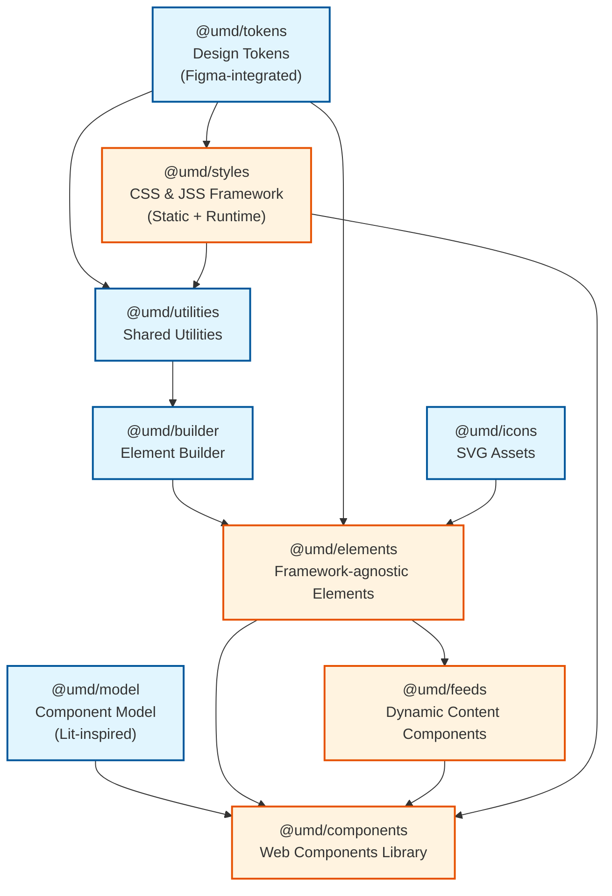

# UMD Design System Architecture Plan

## Executive Summary

This document outlines the strategic development roadmap for the UMD Design System. It covers the current nine-package architecture with clear separation between foundational TypeScript packages and higher-level implementation packages, along with planned improvements for static style exports, element builder adoption, and model modernization.

## Current State (v1.17+)

### Package Structure
- **icons** (v1.0.1) - SVG icon and logo assets
- **tokens** (v1.0.0) - Design token primitives (colors, spacing, typography, media)
- **utilities** (v1.0.2) - Shared utility functions for DOM, styles, performance
- **styles** (v1.7.2) - JSS objects, CSS utilities, design tokens (re-exports)
- **model** (v1.0.3) - Web component model utilities (attributes, slots, registration)
- **builder** (v1.0.0) - Fluent element builder with lifecycle management
- **elements** (v1.5.5) - Foundational UI element builders
- **feeds** (v1.3.4) - Dynamic content feed components
- **components** (v1.16.4) - Web Components (Custom Elements)

### Current Dependency Flow
```
icons (no dependencies)
tokens (no dependencies)
  ├── styles (depends on tokens)
  │   └── utilities (depends on tokens, styles)
  │       └── builder (depends on utilities, peer: styles)
  │           └── elements (depends on tokens, builder, utilities, peer: styles, icons)
  │               └── feeds (depends on tokens, elements, utilities)
  │                   └── components (depends on all above)
model (peer: styles)
```

## Upcoming Work (v1.17 - v2.x)

### Priority 1: Static Build-Time Exports from Styles Package

**Goal**: Generate pre-compiled CSS at build time for better performance and reduced runtime overhead.

**Current State**: JSS objects are converted to CSS at runtime, requiring JavaScript execution.

**Target State**: Provide static CSS files that can be imported directly or loaded via CDN.

**Implementation**:
```typescript
// Current (runtime compilation)
import * as typography from '@universityofmaryland/web-styles-library/typography';
const css = convertJSSObjectToStyles(typography.sans.larger);

// Target (static import)
import '@universityofmaryland/web-styles-library/css/typography/sans.css';
// or
<link rel="stylesheet" href="/styles/typography/sans.css">
```

**Benefits**:
- Faster initial page load (no runtime JSS compilation)
- Better SSR compatibility
- Reduced JavaScript bundle size
- Improved Core Web Vitals

**Tasks**:
- [ ] Add PostCSS build step to styles package
- [ ] Generate static CSS files during build
- [ ] Create CSS entry points in package.json exports
- [ ] Update CDN build to include pre-compiled CSS
- [ ] Document static import patterns

---

### Priority 2: Elements Package Migration to Element Builder

**Goal**: Refactor all elements to use the ElementBuilder pattern for consistency and maintainability.

**Current State**: Mixed patterns - some elements use direct DOM manipulation, others use ElementBuilder.

**Target State**: All elements consistently use ElementBuilder with the fluent API.

**Implementation**:
```typescript
// Before (direct manipulation)
export const createTextLockup = (props: TextLockupProps): ElementModel => {
  const container = document.createElement('div');
  container.classList.add('umd-text-lockup');
  // ... manual DOM construction
  return { element: container, styles };
};

// After (ElementBuilder)
export const createTextLockup = (props: TextLockupProps): ElementModel => {
  return new ElementBuilder('div')
    .withClassName('umd-text-lockup')
    .styled(textLockupStyles)
    .withChildIf(props.eyebrow, eyebrowElement)
    .withChild(headlineElement)
    .withChildIf(props.text, textElement)
    .build();
};
```

**Benefits**:
- Consistent API across all elements
- Automatic lifecycle management
- Built-in style priority system
- Better developer experience

**Migration Order**:
1. [ ] Atomic elements (text-lockup, buttons, actions)
2. [ ] Assets (images, videos, gifs)
3. [ ] Events (meta, sign)
4. [ ] Composite elements (cards, heroes, navigation)
5. [ ] Complex composites (carousel, pathway, footer)

---

### Priority 3: Model Package Refactoring (v1.1.0)

**Goal**: Enhance the model package with testing utilities, improved event/slot handling, type-safe attributes, and a reactive update cycle — all backwards compatible and opt-in.

**Current State**: v1.0.3 with attribute checks, slot factories, and `createCustomElement` factory.

**Target State**: 5 new modules layered on top of existing APIs.

#### Module 1: Testing (`./testing` export)

Test fixture and helper utilities for component authors:

```typescript
import { createFixture, queryShadow, simulateEvent } from '@universityofmaryland/web-model-library/testing';

const el = await createFixture('<umd-card data-theme="dark"></umd-card>');
const heading = queryShadow(el, 'h3');
simulateEvent(el, 'click');
```

- [ ] `createFixture` / `cleanupFixtures` — mount components in JSDOM
- [ ] `queryShadow` / `queryShadowAll` — shadow DOM traversal
- [ ] `simulateEvent` / `waitForEvent` — event simulation
- [ ] `createSlotContent` / `assertSlot` — slot test helpers

#### Module 2: Utilities Enhancements

```typescript
import { createLogger, isDev } from '@universityofmaryland/web-model-library/utilities';
import { createCustomEvent, delegate } from '@universityofmaryland/web-model-library/utilities';

const log = createLogger('umd-card');
log.warn('Deprecated attribute used');

delegate(container, 'click', '.action-btn', handler);
```

- [ ] `debug.ts` — `isDev`, `createLogger` with namespaced output
- [ ] `events.ts` — `createCustomEvent`, `dispatchCustomEvent`, `defineEvents`, `createEventListener`, `delegate`

#### Module 3: Slots Enhancements

```typescript
import { createSlotchangeHandler, SlotCache } from '@universityofmaryland/web-model-library/slots';

const cache = new SlotCache(shadowRoot);
const handler = createSlotchangeHandler((nodes) => { /* react to slot changes */ });
```

- [ ] `slot-validation.ts` — `SlotConfig` interface for declarative slot definitions
- [ ] `slot-query.ts` — enhanced query helpers for slot content
- [ ] `slot-events.ts` — `createSlotchangeHandler`, `SlotCache`, `SlotchangeController`

#### Module 4: Attributes Enhancements

```typescript
import { AttributeConverter, AttributeConfig } from '@universityofmaryland/web-model-library/attributes';

const config: AttributeConfig = {
  theme: { type: String, reflect: true, default: 'light' },
  count: { type: Number, default: 0 },
};
```

- [ ] `converters.ts` — `AttributeConverter` (String, Number, Boolean, JSON, custom)
- [ ] `config.ts` — `AttributeConfig` declarative definitions
- [ ] `change-detection.ts` — `ChangeDetectors` for efficient dirty checking
- [ ] `errors.ts` — `AttributeTypeError`, `AttributeValidationError`

#### Module 5: Model Enhancements

```typescript
// Extended lifecycle hooks
firstConnected() { /* runs once on first connection */ }
willFirstUpdate() { /* runs before first render */ }

// Batched updates
this.requestUpdate();
await this.updateComplete;

// Reactive controllers
class FocusController implements ReactiveController {
  hostConnected() { /* attach listeners */ }
  hostDisconnected() { /* cleanup */ }
}
```

- [ ] `base-component.ts` — `firstConnected`, `willFirstUpdate` lifecycle hooks
- [ ] `update-cycle.ts` — `requestUpdate`, `updateComplete` promise
- [ ] `controllers.ts` — `ReactiveController` interface
- [ ] `registration.ts` — `registerComponent` with validation

**Compatibility Note**: All changes are additive. Existing components continue to work unchanged. New patterns are available for gradual adoption.

---

## Target Architecture (v2.x)

### Nine-Package Architecture Overview



### Package Categories

#### Foundation Packages (Zero/Minimal Dependencies)

1. **@umd/icons** - SVG icon assets
2. **@umd/tokens** - Pure design tokens (Figma-integrated future)
3. **@umd/utilities** - Shared utility functions
4. **@umd/model** - Web component model (Lit-inspired)
5. **@umd/builder** - Element construction utilities

#### Implementation Packages (Consumer-Facing)

6. **@umd/styles** - CSS classes, JSS objects, static CSS exports
7. **@umd/elements** - Pro-code framework-agnostic elements
8. **@umd/feeds** - AJAX-powered API integration
9. **@umd/components** - No-code Web Components

## Detailed Package Specifications

### Foundation Layer (TypeScript Packages)

#### 1. @umd/tokens

**Purpose**: Centralized design tokens synchronized with Figma, providing the single source of truth for design decisions.

**Responsibilities**:
- Color palettes and semantic color mappings
- Typography scales and font definitions
- Spacing system (margins, padding, gaps)
- Breakpoints and responsive values
- Animation timing and easing functions
- Border radii, shadows, and effects
- Z-index scale

**Technical Implementation**:
```typescript
// Example token structure
interface DesignTokens {
  colors: {
    primary: ColorScale;
    secondary: ColorScale;
    semantic: SemanticColors;
  };
  typography: {
    fontFamilies: FontFamilyTokens;
    fontSizes: FontSizeScale;
    lineHeights: LineHeightScale;
  };
  spacing: SpacingScale;
  breakpoints: BreakpointTokens;
}
```

**Output Formats**:
- CSS custom properties
- JavaScript/TypeScript objects
- SCSS variables
- JSON for tooling integration

**Figma Integration**:
- Figma Tokens plugin for bidirectional sync
- GitHub Actions workflow for automated updates
- Version control for design changes
- Change logs for token modifications

#### 2. @umd/element-model

**Purpose**: Abstract element composition layer providing base classes and interfaces for all UI elements.

**Responsibilities**:
- Base element class with lifecycle hooks
- Event handling patterns and delegation
- State management abstractions
- Accessibility foundations (ARIA, keyboard nav)
- DOM manipulation utilities
- Performance optimizations (virtual DOM hints)

**Core Interfaces**:
```typescript
interface ElementModel {
  element: HTMLElement | DocumentFragment;
  styles: string;
  update?: (props: any) => void;
  destroy?: () => void;
  events?: ElementEvents;
  state?: ElementState;
}

abstract class BaseElement {
  protected model: ElementModel;
  abstract render(): void;
  abstract update(props: Partial<ElementProps>): void;
  abstract destroy(): void;
}
```

**Key Features**:
- Framework-agnostic implementation
- TypeScript strict mode
- Tree-shakeable exports
- Minimal runtime overhead

#### 3. @umd/component-model

**Purpose**: Higher-order component patterns for complex UI composition.

**Responsibilities**:
- Component composition strategies
- Prop validation and type checking
- Render optimization patterns
- Slot and template management
- Component communication protocols
- Compound component patterns

**Core Patterns**:
```typescript
interface ComponentConfiguration {
  slots: SlotConfiguration;
  props: PropConfiguration;
  events: EventConfiguration;
  children?: ComponentConfiguration[];
}

class ComponentComposer {
  static compose(config: ComponentConfiguration): ComponentModel;
  static validate(props: unknown): ValidationResult;
  static optimize(render: RenderFunction): OptimizedRender;
}
```

### Implementation Layer (Consumer-Facing Packages)

#### 4. @umd/components

**Purpose**: No-code Web Components library for CMS and visual builders.

**Target Audience**: Content editors, marketing teams, no-code developers

**Features**:
- Ready-to-use Web Components
- Auto-registration with customElements
- Lazy loading and code splitting
- Visual builder integrations
- HTML-first API design
- Progressive enhancement

**Example Usage**:
```html
<umd-card data-theme="dark" data-variant="overlay">
  <h3 slot="headline">Card Title</h3>
  <p slot="text">Card content goes here</p>
  <button slot="action">Learn More</button>
</umd-card>
```

#### 5. @umd/elements

**Purpose**: Pro-code framework-agnostic elements for developers.

**Target Audience**: Frontend developers, framework users

**Features**:
- React, Vue, Angular adapters
- TypeScript-first development
- Framework-specific optimizations
- Server-side rendering support
- Advanced prop typing
- Composition API

**Framework Adapters**:
```typescript
// React
import { Card } from '@umd/elements/react';

// Vue
import { UmdCard } from '@umd/elements/vue';

// Angular
import { UmdElementsModule } from '@umd/elements/angular';
```

#### 6. @umd/styles

**Purpose**: CSS and layout framework for rapid development.

**Features**:
- Utility-first CSS classes
- Layout systems (Grid, Flexbox, Container)
- Typography utilities
- Responsive helpers
- JSS objects for CSS-in-JS
- PostCSS plugin support

**Usage Patterns**:
```css
/* CSS Classes */
.umd-grid-3 { }
.umd-text-primary { }
.umd-spacing-lg { }

/* JSS Objects */
import { layouts } from '@umd/styles/jss';
```

#### 7. @umd/feeds

**Purpose**: Dynamic content integration components.

**Features**:
- AJAX data fetching
- API integration patterns
- Pagination and infinite scroll
- Real-time updates
- Error handling and retry logic
- Caching strategies

## Migration Strategy

### Phase 1: Token Extraction (Months 1-2)
**Goal**: Extract design tokens without breaking changes

- [ ] Create @umd/tokens package
- [ ] Set up Figma integration pipeline
- [ ] Migrate token definitions from styles package
- [ ] Create compatibility layer in styles package
- [ ] Update build processes
- [ ] Document token usage patterns

### Phase 2: Model Package Creation (Months 2-4)
**Goal**: Establish foundation layer

- [ ] Develop @umd/element-model package
- [ ] Develop @umd/component-model package
- [ ] Create comprehensive test suites
- [ ] Write migration guides
- [ ] Build adapter layers for existing packages

### Phase 3: Package Refactoring (Months 4-6)
**Goal**: Refactor existing packages to use new models

- [ ] Refactor elements package to use element-model
- [ ] Refactor components package to use component-model
- [ ] Update feeds package dependencies
- [ ] Maintain backward compatibility
- [ ] Create codemods for automated migration

### Phase 4: Optimization (Months 6-7)
**Goal**: Remove legacy code and optimize

- [ ] Remove deprecated code paths
- [ ] Optimize bundle sizes
- [ ] Improve tree-shaking
- [ ] Performance benchmarking
- [ ] Final documentation updates

## API Contracts

### Token Consumer Contract
```typescript
interface TokenConsumer {
  tokens: DesignTokens;
  getToken(path: string): TokenValue;
  getCSSVariable(token: string): string;
}
```

### Element Model Contract
```typescript
interface ElementContract {
  create(props: ElementProps): ElementModel;
  update(model: ElementModel, props: Partial<ElementProps>): void;
  destroy(model: ElementModel): void;
}
```

### Component Model Contract
```typescript
interface ComponentContract {
  register(config: ComponentConfiguration): void;
  compose(components: ComponentModel[]): CompositeModel;
  validate(props: unknown): ValidationResult;
}
```

## Build and Deployment Strategy

### Monorepo Configuration
```json
{
  "workspaces": [
    "packages/tokens",
    "packages/element-model",
    "packages/component-model",
    "packages/components",
    "packages/elements",
    "packages/styles",
    "packages/feeds"
  ]
}
```

### Build Pipeline
1. **Parallel builds** for independent packages
2. **Topological sorting** for dependent builds
3. **Incremental compilation** with TypeScript project references
4. **Shared webpack configurations**
5. **Unified babel presets**

### Release Strategy
- **Independent versioning** per package
- **Automated changelogs** with conventional commits
- **Coordinated releases** for breaking changes
- **Beta channel** for early adopters
- **Migration period** with dual support

## Success Metrics

### Technical Metrics
- [ ] TypeScript coverage > 95%
- [ ] Bundle size reduction > 20%
- [ ] Build time improvement > 30%
- [ ] Test execution time < 5 minutes
- [ ] Zero circular dependencies

### Developer Experience Metrics
- [ ] Onboarding time reduced by 50%
- [ ] API documentation coverage 100%
- [ ] Framework integration examples for top 3 frameworks
- [ ] Migration guide completion rate > 80%

### Business Metrics
- [ ] Adoption rate in new projects > 90%
- [ ] Support ticket reduction > 40%
- [ ] Developer satisfaction score > 4.5/5

## Risk Mitigation

### Technical Risks
- **Risk**: Breaking changes in production
  - **Mitigation**: Extensive compatibility layer, feature flags, gradual rollout

- **Risk**: Performance degradation
  - **Mitigation**: Continuous benchmarking, performance budgets, rollback plan

- **Risk**: Complex migration path
  - **Mitigation**: Automated codemods, step-by-step guides, support channels

### Organizational Risks
- **Risk**: Team resistance to change
  - **Mitigation**: Early stakeholder involvement, training sessions, champions program

- **Risk**: Timeline slippage
  - **Mitigation**: Phased approach, MVP for each phase, flexible scope

## Implementation Roadmap

### Completed (v1.14 - v1.16)
- ✅ Vite build system across all packages
- ✅ Icons package (v1.0.0) - standalone SVG assets
- ✅ Tokens package (v1.0.0) - design token primitives
- ✅ Utilities package (v1.0.0) - shared utility functions
- ✅ Model package (v1.0.0) - component model utilities
- ✅ Builder package (v1.0.0) - element construction utilities
- ✅ ES Modules only output (removed CommonJS)
- ✅ Named exports only pattern
- ✅ Automated CI/CD release workflow
- ✅ Element Model conversions (Quote, Footer, Alert, Hero, Cards)

### Q1 2025 (v1.17)
- [ ] Complete ElementBuilder migration in elements package (atomic elements)
- [ ] Static CSS exports from styles package (initial implementation)
- [x] Experts Feed implementation (grid, list, bio, in-the-news)
- [x] In-The-News Feed implementation (grid, list)
- [x] Events/Academic slider migration to widget pattern

### Q2 2025 (v1.18)
- [ ] Complete ElementBuilder migration (composite elements)
- [ ] Model package v1.1.0 refactoring (Testing, Utilities, Slots modules)
- [ ] Static CSS exports (complete implementation)
- [ ] Figma token sync (Phase 2 planning)

### Q3 2025 (v1.19 / v2.0-beta)
- [ ] Model package v1.1.0 completion (Attributes, Model modules)
- [ ] Framework adapters for elements (React, Vue)
- [ ] Performance optimization phase
- [ ] Beta release of v2.0 architecture

### Q4 2025 (v2.0)
- [ ] General availability release
- [ ] Complete documentation update
- [ ] Migration guides for v1.x to v2.x
- [ ] Deprecation of legacy patterns

## Appendix

### Current Status

**Latest Release**: v1.17.5 (Components)
**Branch**: patch/1.17
**Date**: 2026-02-13
**Current Focus**: ElementBuilder adoption, feeds experts/in-the-news stabilization

### Recently Completed
- ✅ Named exports migration across all packages
- ✅ Feeds factory pattern implementation
- ✅ Feeds experts and in-the-news feeds (v1.3.0+)
- ✅ Events/Academic slider migration to widget pattern
- ✅ Composable style functions in styles package
- ✅ Theme system enhancements
- ✅ CI/CD automation with GitHub Actions

### In Progress
- [ ] ElementBuilder adoption in elements package
- [ ] Static CSS exports planning
- [ ] Model package v1.1.0 refactoring (5-module plan)

### Next Steps
- [ ] Begin static CSS export implementation
- [ ] Implement model testing module (`./testing` export)
- [ ] Implement model utilities enhancements (debug, events)
- [ ] Implement model slots enhancements (validation, slotchange)
- [ ] Plan Figma integration Phase 2