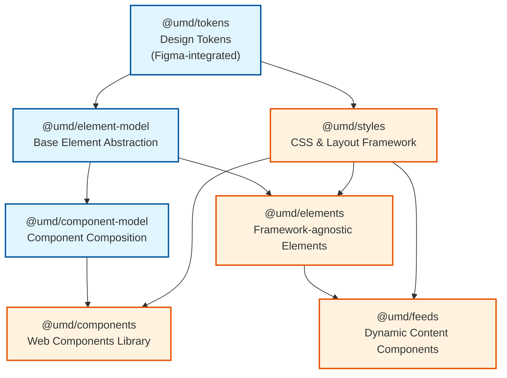

# UMD Design System Architecture Plan

## Executive Summary

This document outlines the strategic restructuring of the UMD Design System from its current four-package architecture to a seven-package architecture with clear separation between foundational TypeScript packages and higher-level implementation packages.

## Current State (v1.x)

### Package Structure
- **styles** (v1.5.0) - Mixed responsibilities: JSS objects, design tokens, CSS utilities
- **elements** (v1.3.7) - Foundational UI elements using element model
- **components** (v1.13.0-beta.3) - High-level web components
- **feeds** (v1.0.7) - Dynamic content feed components

### Current Dependency Flow
```
styles (no UMD dependencies)
  ├── elements (depends on styles)
  │   ├── components (depends on elements, styles)
  │   └── feeds (depends on elements, styles)
```

## Target Architecture (v2.x)

### Seven-Package Architecture Overview



### Package Categories

#### Lower-Level TypeScript Foundation Packages

1. **@umd/tokens** - Pure Design Tokens
2. **@umd/element-model** - Base Element Abstraction Layer
3. **@umd/component-model** - Component Composition Patterns

#### Higher-Level Implementation Packages

4. **@umd/components** - No-code Web Components
5. **@umd/elements** - Pro-code Framework-agnostic Elements
6. **@umd/styles** - CSS Classes and JSS Objects
7. **@umd/feeds** - AJAX-powered API Integration

## Detailed Package Specifications

### Foundation Layer (TypeScript Packages)

#### 1. @umd/tokens

**Purpose**: Centralized design tokens synchronized with Figma, providing the single source of truth for design decisions.

**Responsibilities**:
- Color palettes and semantic color mappings
- Typography scales and font definitions
- Spacing system (margins, padding, gaps)
- Breakpoints and responsive values
- Animation timing and easing functions
- Border radii, shadows, and effects
- Z-index scale

**Technical Implementation**:
```typescript
// Example token structure
interface DesignTokens {
  colors: {
    primary: ColorScale;
    secondary: ColorScale;
    semantic: SemanticColors;
  };
  typography: {
    fontFamilies: FontFamilyTokens;
    fontSizes: FontSizeScale;
    lineHeights: LineHeightScale;
  };
  spacing: SpacingScale;
  breakpoints: BreakpointTokens;
}
```

**Output Formats**:
- CSS custom properties
- JavaScript/TypeScript objects
- SCSS variables
- JSON for tooling integration

**Figma Integration**:
- Figma Tokens plugin for bidirectional sync
- GitHub Actions workflow for automated updates
- Version control for design changes
- Change logs for token modifications

#### 2. @umd/element-model

**Purpose**: Abstract element composition layer providing base classes and interfaces for all UI elements.

**Responsibilities**:
- Base element class with lifecycle hooks
- Event handling patterns and delegation
- State management abstractions
- Accessibility foundations (ARIA, keyboard nav)
- DOM manipulation utilities
- Performance optimizations (virtual DOM hints)

**Core Interfaces**:
```typescript
interface ElementModel {
  element: HTMLElement | DocumentFragment;
  styles: string;
  update?: (props: any) => void;
  destroy?: () => void;
  events?: ElementEvents;
  state?: ElementState;
}

abstract class BaseElement {
  protected model: ElementModel;
  abstract render(): void;
  abstract update(props: Partial<ElementProps>): void;
  abstract destroy(): void;
}
```

**Key Features**:
- Framework-agnostic implementation
- TypeScript strict mode
- Tree-shakeable exports
- Minimal runtime overhead

#### 3. @umd/component-model

**Purpose**: Higher-order component patterns for complex UI composition.

**Responsibilities**:
- Component composition strategies
- Prop validation and type checking
- Render optimization patterns
- Slot and template management
- Component communication protocols
- Compound component patterns

**Core Patterns**:
```typescript
interface ComponentConfiguration {
  slots: SlotConfiguration;
  props: PropConfiguration;
  events: EventConfiguration;
  children?: ComponentConfiguration[];
}

class ComponentComposer {
  static compose(config: ComponentConfiguration): ComponentModel;
  static validate(props: unknown): ValidationResult;
  static optimize(render: RenderFunction): OptimizedRender;
}
```

### Implementation Layer (Consumer-Facing Packages)

#### 4. @umd/components

**Purpose**: No-code Web Components library for CMS and visual builders.

**Target Audience**: Content editors, marketing teams, no-code developers

**Features**:
- Ready-to-use Web Components
- Auto-registration with customElements
- Lazy loading and code splitting
- Visual builder integrations
- HTML-first API design
- Progressive enhancement

**Example Usage**:
```html
<umd-card data-theme="dark" data-variant="overlay">
  <h3 slot="headline">Card Title</h3>
  <p slot="text">Card content goes here</p>
  <button slot="action">Learn More</button>
</umd-card>
```

#### 5. @umd/elements

**Purpose**: Pro-code framework-agnostic elements for developers.

**Target Audience**: Frontend developers, framework users

**Features**:
- React, Vue, Angular adapters
- TypeScript-first development
- Framework-specific optimizations
- Server-side rendering support
- Advanced prop typing
- Composition API

**Framework Adapters**:
```typescript
// React
import { Card } from '@umd/elements/react';

// Vue
import { UmdCard } from '@umd/elements/vue';

// Angular
import { UmdElementsModule } from '@umd/elements/angular';
```

#### 6. @umd/styles

**Purpose**: CSS and layout framework for rapid development.

**Features**:
- Utility-first CSS classes
- Layout systems (Grid, Flexbox, Container)
- Typography utilities
- Responsive helpers
- JSS objects for CSS-in-JS
- PostCSS plugin support

**Usage Patterns**:
```css
/* CSS Classes */
.umd-grid-3 { }
.umd-text-primary { }
.umd-spacing-lg { }

/* JSS Objects */
import { layouts } from '@umd/styles/jss';
```

#### 7. @umd/feeds

**Purpose**: Dynamic content integration components.

**Features**:
- AJAX data fetching
- API integration patterns
- Pagination and infinite scroll
- Real-time updates
- Error handling and retry logic
- Caching strategies

## Migration Strategy

### Phase 1: Token Extraction (Months 1-2)
**Goal**: Extract design tokens without breaking changes

- [ ] Create @umd/tokens package
- [ ] Set up Figma integration pipeline
- [ ] Migrate token definitions from styles package
- [ ] Create compatibility layer in styles package
- [ ] Update build processes
- [ ] Document token usage patterns

### Phase 2: Model Package Creation (Months 2-4)
**Goal**: Establish foundation layer

- [ ] Develop @umd/element-model package
- [ ] Develop @umd/component-model package
- [ ] Create comprehensive test suites
- [ ] Write migration guides
- [ ] Build adapter layers for existing packages

### Phase 3: Package Refactoring (Months 4-6)
**Goal**: Refactor existing packages to use new models

- [ ] Refactor elements package to use element-model
- [ ] Refactor components package to use component-model
- [ ] Update feeds package dependencies
- [ ] Maintain backward compatibility
- [ ] Create codemods for automated migration

### Phase 4: Optimization (Months 6-7)
**Goal**: Remove legacy code and optimize

- [ ] Remove deprecated code paths
- [ ] Optimize bundle sizes
- [ ] Improve tree-shaking
- [ ] Performance benchmarking
- [ ] Final documentation updates

## API Contracts

### Token Consumer Contract
```typescript
interface TokenConsumer {
  tokens: DesignTokens;
  getToken(path: string): TokenValue;
  getCSSVariable(token: string): string;
}
```

### Element Model Contract
```typescript
interface ElementContract {
  create(props: ElementProps): ElementModel;
  update(model: ElementModel, props: Partial<ElementProps>): void;
  destroy(model: ElementModel): void;
}
```

### Component Model Contract
```typescript
interface ComponentContract {
  register(config: ComponentConfiguration): void;
  compose(components: ComponentModel[]): CompositeModel;
  validate(props: unknown): ValidationResult;
}
```

## Build and Deployment Strategy

### Monorepo Configuration
```json
{
  "workspaces": [
    "packages/tokens",
    "packages/element-model",
    "packages/component-model",
    "packages/components",
    "packages/elements",
    "packages/styles",
    "packages/feeds"
  ]
}
```

### Build Pipeline
1. **Parallel builds** for independent packages
2. **Topological sorting** for dependent builds
3. **Incremental compilation** with TypeScript project references
4. **Shared webpack configurations**
5. **Unified babel presets**

### Release Strategy
- **Independent versioning** per package
- **Automated changelogs** with conventional commits
- **Coordinated releases** for breaking changes
- **Beta channel** for early adopters
- **Migration period** with dual support

## Success Metrics

### Technical Metrics
- [ ] TypeScript coverage > 95%
- [ ] Bundle size reduction > 20%
- [ ] Build time improvement > 30%
- [ ] Test execution time < 5 minutes
- [ ] Zero circular dependencies

### Developer Experience Metrics
- [ ] Onboarding time reduced by 50%
- [ ] API documentation coverage 100%
- [ ] Framework integration examples for top 3 frameworks
- [ ] Migration guide completion rate > 80%

### Business Metrics
- [ ] Adoption rate in new projects > 90%
- [ ] Support ticket reduction > 40%
- [ ] Developer satisfaction score > 4.5/5

## Risk Mitigation

### Technical Risks
- **Risk**: Breaking changes in production
  - **Mitigation**: Extensive compatibility layer, feature flags, gradual rollout

- **Risk**: Performance degradation
  - **Mitigation**: Continuous benchmarking, performance budgets, rollback plan

- **Risk**: Complex migration path
  - **Mitigation**: Automated codemods, step-by-step guides, support channels

### Organizational Risks
- **Risk**: Team resistance to change
  - **Mitigation**: Early stakeholder involvement, training sessions, champions program

- **Risk**: Timeline slippage
  - **Mitigation**: Phased approach, MVP for each phase, flexible scope

## Implementation Roadmap

### Q1 2025
- Set up monorepo infrastructure
- Extract tokens package
- Begin element-model development

### Q2 2025
- Complete model packages
- Start migration of existing packages
- Beta release of new architecture

### Q3 2025
- Complete migration
- Optimization phase
- Documentation and training

### Q4 2025
- General availability release
- Deprecation of legacy APIs
- Performance optimization

## Appendix

### Current Session Info

**Branch**: feature/add-changelogs  
**Date**: 2025-08-09  
**Current Focus**: Architecture planning and documentation

### Completed Tasks
- ✅ Created feature branch for changelog work
- ✅ Created CHANGELOG.md for all packages
- ✅ Updated PLAN.md with seven-package architecture

### Next Steps
- [ ] Review architecture plan with stakeholders
- [ ] Create proof-of-concept for tokens package
- [ ] Draft RFC for community feedback
- [ ] Set up prototype monorepo structure